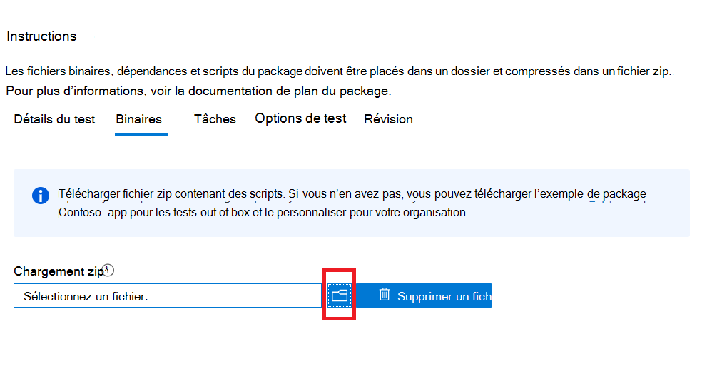

# <a name="step-3-upload-your-binaries-dependencies-and-scripts"></a><span data-ttu-id="38632-103">Étape 3 : Télécharger vos binaires, dépendances et scripts</span><span class="sxs-lookup"><span data-stu-id="38632-103">Step 3: Upload your binaries, dependencies, and scripts</span></span>

<span data-ttu-id="38632-104">Sous cet onglet, vous allez télécharger un package zip unique contenant vos fichiers binaires, dépendances et scripts utilisés pour exécuter votre suite de test.</span><span class="sxs-lookup"><span data-stu-id="38632-104">On this tab, you will upload a single zip package containing your binaries, dependencies and scripts used to run your test suite.</span></span>

## <a name="upload-package-zip-file"></a><span data-ttu-id="38632-105">Télécharger fichier zip du package</span><span class="sxs-lookup"><span data-stu-id="38632-105">Upload package zip file</span></span>



  - <span data-ttu-id="38632-107">Les dépendances téléchargées peuvent inclure des frameworks de test, des moteurs de script ou des données accessibles pour exécuter votre application ou des cas de test.</span><span class="sxs-lookup"><span data-stu-id="38632-107">Uploaded dependencies can include test frameworks, scripting engines or data that will be accessed to run your application or test cases.</span></span> <span data-ttu-id="38632-108">Par exemple, vous pouvez télécharger Selenium et un programme d’installation webdriver pour vous aider à exécuter des tests basés sur le navigateur.</span><span class="sxs-lookup"><span data-stu-id="38632-108">For example, you can upload Selenium and a webdriver installer to help run browser-based tests.</span></span>
  - <span data-ttu-id="38632-109">Il est préférable de s’assurer que vos activités de script restent modulaires, c’est-à-dire.</span><span class="sxs-lookup"><span data-stu-id="38632-109">It is best practice to ensure your script activities are kept modular i.e.</span></span> 
    - <span data-ttu-id="38632-110">Le ```Install``` script effectue uniquement des opérations d’installation.</span><span class="sxs-lookup"><span data-stu-id="38632-110">The ```Install``` script only performs install operations.</span></span>
    - <span data-ttu-id="38632-111">Le ```Launch``` script lance uniquement l’application.</span><span class="sxs-lookup"><span data-stu-id="38632-111">The ```Launch``` script only launches the application.</span></span>
    - <span data-ttu-id="38632-112">Le ```Close``` script ferme uniquement l’application.</span><span class="sxs-lookup"><span data-stu-id="38632-112">The ```Close``` script only closes the application.</span></span>
    - <span data-ttu-id="38632-113">Le ```Uninstall``` script facultatif désinstalle uniquement l’application.</span><span class="sxs-lookup"><span data-stu-id="38632-113">The optional ```Uninstall``` script only uninstalls the application.</span></span>

<span data-ttu-id="38632-114">**Actuellement, le portail prend uniquement en charge les scripts PowerShell.**</span><span class="sxs-lookup"><span data-stu-id="38632-114">**Currently, the portal only supports PowerShell scripts.**</span></span>


## <a name="next-steps"></a><span data-ttu-id="38632-115">Étapes suivantes</span><span class="sxs-lookup"><span data-stu-id="38632-115">Next steps</span></span> 

<span data-ttu-id="38632-116">Passer à l’article suivant pour passer à l’étape 4 : **Définir vos tâches de test.**</span><span class="sxs-lookup"><span data-stu-id="38632-116">Advance to the next article to go onto Step 4: **Set your Test Tasks**.</span></span>
> [!div class="nextstepaction"]
> [<span data-ttu-id="38632-117">Retour</span><span class="sxs-lookup"><span data-stu-id="38632-117">Go back</span></span>](uploadApplication.md)
> [!div class="nextstepaction"]
> [<span data-ttu-id="38632-118">Étape suivante</span><span class="sxs-lookup"><span data-stu-id="38632-118">Next step</span></span>](testtask.md)

