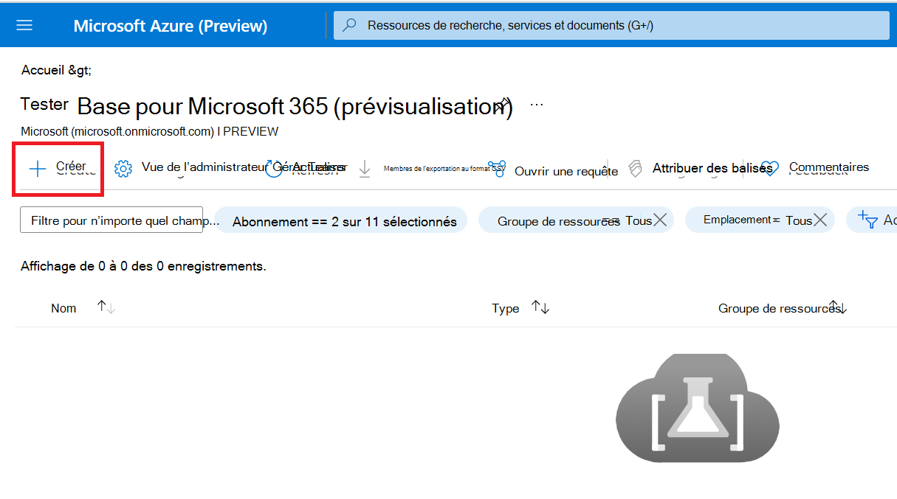
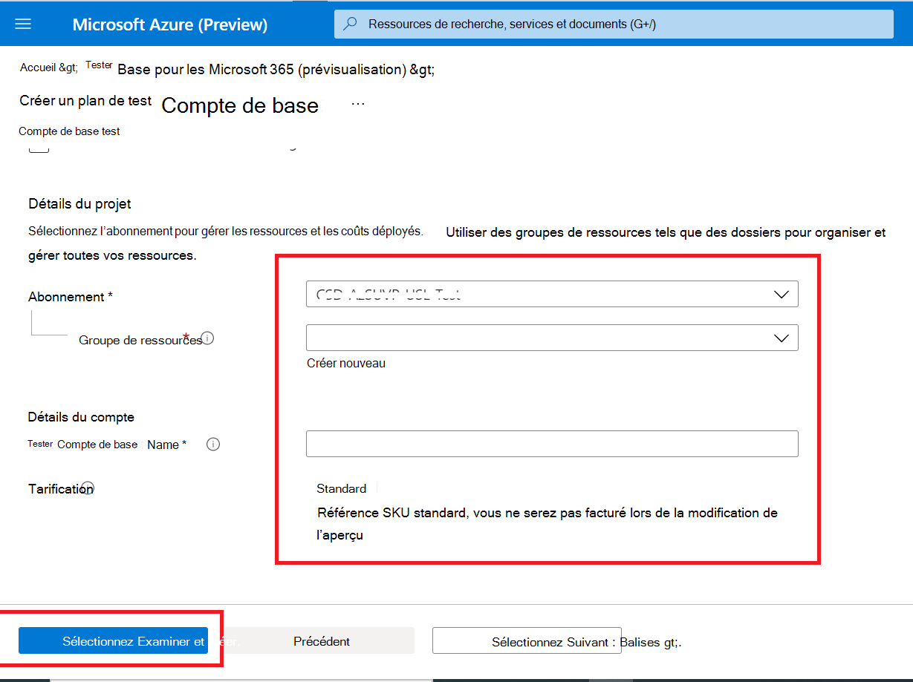

# <a name="step-1-create-a-test-base-account"></a><span data-ttu-id="15f9b-103">Étape 1 : Créer un compte de base de test</span><span class="sxs-lookup"><span data-stu-id="15f9b-103">Step 1: Create a Test Base account</span></span>

<span data-ttu-id="15f9b-104">Si vous n’avez pas d’abonnement Azure, créez [un compte gratuit](https://azure.microsoft.com/en-us/free/) avant de commencer.</span><span class="sxs-lookup"><span data-stu-id="15f9b-104">If you don't have an Azure subscription, create a [free account](https://azure.microsoft.com/en-us/free/) before you begin.</span></span>

## <a name="enter-details-for-test-base-account"></a><span data-ttu-id="15f9b-105">Entrer les détails du compte de base de test</span><span class="sxs-lookup"><span data-stu-id="15f9b-105">Enter details for test base account</span></span>
 
1. <span data-ttu-id="15f9b-106">Recherchez **« Base de test »** dans le portail Azure.</span><span class="sxs-lookup"><span data-stu-id="15f9b-106">Search for **'Test Base'** in the Azure portal.</span></span>


2. <span data-ttu-id="15f9b-108">Cliquez **sur « Ajouter »** pour créer un compte de base de test.</span><span class="sxs-lookup"><span data-stu-id="15f9b-108">Click **'Add'** to create a Test Base account.</span></span>



3.  <span data-ttu-id="15f9b-110">Lisez ensuite ```Terms of Use``` la case à cocher pour confirmer votre satisfaction avec le ```Terms of Use``` .</span><span class="sxs-lookup"><span data-stu-id="15f9b-110">Read through the ```Terms of Use``` then select the checkbox to confirm your satisfaction with the ```Terms of Use```.</span></span>


4.  <span data-ttu-id="15f9b-112">Remplissez les informations correctes selon les conditions suivantes :</span><span class="sxs-lookup"><span data-stu-id="15f9b-112">Fill in the correct information under the following requirements:</span></span> 
    -   <span data-ttu-id="15f9b-113">Abonnement : groupe de ressources</span><span class="sxs-lookup"><span data-stu-id="15f9b-113">Subscription: Resource Group</span></span>
    -   <span data-ttu-id="15f9b-114">Détails de l’instance : nom.</span><span class="sxs-lookup"><span data-stu-id="15f9b-114">Instance Details: Name.</span></span>

<span data-ttu-id="15f9b-115">**Actuellement, la base de test prend uniquement en charge le niveau De tarification standard.**</span><span class="sxs-lookup"><span data-stu-id="15f9b-115">**Currently, Test Base only supports Standard Pricing tier.**</span></span>



5.  <span data-ttu-id="15f9b-117">Enfin, cliquez sur ```Review + Create``` pour valider et activer votre compte nouvellement créé.</span><span class="sxs-lookup"><span data-stu-id="15f9b-117">Finally, click on ```Review + Create``` to validate and enable your newly created account.</span></span>

## <a name="next-steps"></a><span data-ttu-id="15f9b-118">Étapes suivantes</span><span class="sxs-lookup"><span data-stu-id="15f9b-118">Next steps</span></span>

<span data-ttu-id="15f9b-119">Passer à l’article suivant pour commencer à l’étape 2 : **Découvrez comment charger votre package.**</span><span class="sxs-lookup"><span data-stu-id="15f9b-119">Advance to the next article to get started with Step 2: **Learn how upload your package.**</span></span>
> [!div class="nextstepaction"]
> [<span data-ttu-id="15f9b-120">Étape suivante</span><span class="sxs-lookup"><span data-stu-id="15f9b-120">Next step</span></span>](uploadApplication.md)

<!---
Add button for next page
-->
