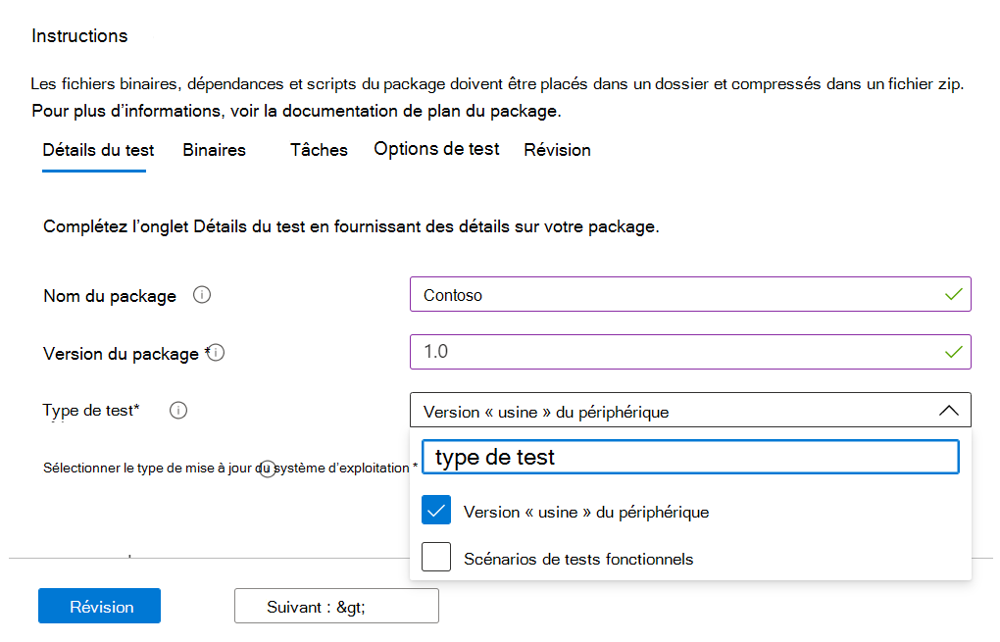
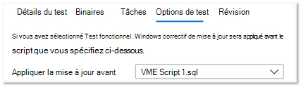

# <a name="functional-testing"></a><span data-ttu-id="a1f7f-103">Test fonctionnel</span><span class="sxs-lookup"><span data-stu-id="a1f7f-103">Functional testing</span></span>

<span data-ttu-id="a1f7f-104">En tant que fournisseur de logiciels, vous pouvez désormais effectuer des tests fonctionnels personnalisés, à l’aide de l’infrastructure de test de votre choix, via la base de test libre-service pour le portail M365.</span><span class="sxs-lookup"><span data-stu-id="a1f7f-104">As a software vendor, you can now perform custom functional tests, using the test framework of your choice - via the self-serve Test Base for M365 portal.</span></span> 

<span data-ttu-id="a1f7f-105">Lors du lancement initial du service, nous avons proposé les tests prédéfinis, qui sont un ensemble prédéfinis de tests pilotés par des scripts standardisés.</span><span class="sxs-lookup"><span data-stu-id="a1f7f-105">When we initially launched the service, we offered the Out-of-box tests, which is a pre-defined set of tests driven through standardized scripting.</span></span> <span data-ttu-id="a1f7f-106">Toutefois, cela n’a pas pu aboutir à une couverture de test complète pour de nombreux éditeurs de logiciels indépendants.</span><span class="sxs-lookup"><span data-stu-id="a1f7f-106">This, however, could not achieve full test coverage for many Independent Software Vendors (ISVs).</span></span> 

<span data-ttu-id="a1f7f-107">Par conséquent, en réponse à vos commentaires, nous fournissons à nos isv la possibilité de télécharger des tests fonctionnels automatisés.</span><span class="sxs-lookup"><span data-stu-id="a1f7f-107">Hence, in response to your feedback, we are providing our ISVs with the ability to upload automated functional tests.</span></span>

<span data-ttu-id="a1f7f-108">Pour utiliser cette fonctionnalité, suivez les étapes ci-dessous :</span><span class="sxs-lookup"><span data-stu-id="a1f7f-108">To use this feature, follow the steps below:</span></span>

1. <span data-ttu-id="a1f7f-109">Télécharger fichiers (fichiers binaires, dépendances et scripts) en tant que package .zip unique.</span><span class="sxs-lookup"><span data-stu-id="a1f7f-109">Upload your files (binaries, dependencies and scripts) as a single .zip package.</span></span>
2. <span data-ttu-id="a1f7f-110">Choisissez si vous souhaitez redémarrer les machines virtuelles (VM) de test à différents points d’exécution.</span><span class="sxs-lookup"><span data-stu-id="a1f7f-110">Choose if you want to reboot the test Virtual Machines (VMs) at various points of execution.</span></span>
3. <span data-ttu-id="a1f7f-111">Gérez les options disponibles pour vos scripts.</span><span class="sxs-lookup"><span data-stu-id="a1f7f-111">Manage available options for your scripts.</span></span>
4. <span data-ttu-id="a1f7f-112">Choisissez quand appliquer la mise à jour Windows sur la VM lors de l’exécution.</span><span class="sxs-lookup"><span data-stu-id="a1f7f-112">Choose when to apply the Windows update on the VM during execution.</span></span>

<span data-ttu-id="a1f7f-113">Les descriptions détaillées des étapes ci-dessus sont mises en évidence ci-dessous :</span><span class="sxs-lookup"><span data-stu-id="a1f7f-113">Detailed descriptions of the above steps are highlighted below:</span></span>

<span data-ttu-id="a1f7f-114">**Télécharger package de test fonctionnel**</span><span class="sxs-lookup"><span data-stu-id="a1f7f-114">**Upload a functional test package**</span></span>

<span data-ttu-id="a1f7f-115">To get started, navigate to the Télécharger page, select Télécharger new application under Application catalog on the left-side navigation menu of the Test Base for M365 portal in Azure.</span><span class="sxs-lookup"><span data-stu-id="a1f7f-115">To get started, navigate to the Upload page, select Upload new application under Application catalog on the left-side navigation menu of the Test Base for M365 portal in Azure.</span></span> <span data-ttu-id="a1f7f-116">À partir de là :</span><span class="sxs-lookup"><span data-stu-id="a1f7f-116">From there:</span></span>

<span data-ttu-id="a1f7f-117">Onglet 1 : entrez les informations de base.</span><span class="sxs-lookup"><span data-stu-id="a1f7f-117">Tab 1 - Enter basic information.</span></span> <span data-ttu-id="a1f7f-118">Fournissez le nom et la version de votre application.</span><span class="sxs-lookup"><span data-stu-id="a1f7f-118">Provide the name and version of your application.</span></span> <span data-ttu-id="a1f7f-119">Dans l’option Type de test, sélectionnez ```Functional tests``` .</span><span class="sxs-lookup"><span data-stu-id="a1f7f-119">In the Type of test option, select ```Functional tests```.</span></span> 

<span data-ttu-id="a1f7f-120">*Notez que l’option OOB (Out-of-Box) est requise par défaut.*</span><span class="sxs-lookup"><span data-stu-id="a1f7f-120">*Note that the Out-of-Box (OOB) option is required by default.*</span></span>




<span data-ttu-id="a1f7f-122">Onglet 2 : Télécharger composants de votre package en chargeant un fichier zip avec l’intégralité de votre test (fichiers binaires, dépendances, scripts, etc.).</span><span class="sxs-lookup"><span data-stu-id="a1f7f-122">Tab 2 - Upload the components of your package by uploading a zip file with your entire test (binaries, dependencies, scripts etc).</span></span> 

<span data-ttu-id="a1f7f-123">Voir aka.ms/usl-package-outline pour plus d’informations.</span><span class="sxs-lookup"><span data-stu-id="a1f7f-123">See aka.ms/usl-package-outline for details.</span></span> <span data-ttu-id="a1f7f-124">(Remarque : les scripts de test Out-of-Box et le contenu du test fonctionnel doivent être placés dans le même fichier zip).</span><span class="sxs-lookup"><span data-stu-id="a1f7f-124">(Note: Both the Out-of-Box test scripts and the Functional test contents should be placed into the same zip file).</span></span> <span data-ttu-id="a1f7f-125">Actuellement, la taille du fichier est limitée à 2 Go.</span><span class="sxs-lookup"><span data-stu-id="a1f7f-125">Currently, the file size is limited to 2GB.</span></span>

<span data-ttu-id="a1f7f-126">Onglet 3 : configurer les tâches de test out-of-box et Fonctionnelles.</span><span class="sxs-lookup"><span data-stu-id="a1f7f-126">Tab 3 - Configure the Out-of-Box and Functional test tasks.</span></span> <span data-ttu-id="a1f7f-127">Ici, choisissez le ou les chemins d’accès aux scripts PowerShell qui installeront, lanceront, fermeront et désinstalleront votre application (pour Out-of-Box), ainsi que les chemins d’accès à tous vos scripts personnalisés pour effectuer votre test fonctionnel.</span><span class="sxs-lookup"><span data-stu-id="a1f7f-127">Here, choose the path(s) to the PowerShell scripts that will install, launch, close, and uninstall your application (for Out-of-Box) as well as the path(s) to all your custom scripts to perform your functional test.</span></span> <span data-ttu-id="a1f7f-128">**(Remarque : un script pour désinstaller votre application est facultatif).**</span><span class="sxs-lookup"><span data-stu-id="a1f7f-128">**(Note: A script to uninstall your application is optional).**</span></span>

<span data-ttu-id="a1f7f-129">Actuellement, vous pouvez charger entre 1 et 8 scripts pour vos tests fonctionnels.</span><span class="sxs-lookup"><span data-stu-id="a1f7f-129">Currently, you can upload between 1 and 8 scripts for your functional tests.</span></span> <span data-ttu-id="a1f7f-130">(Faites un commentaire sur ce billet si vous avez besoin de davantage de scripts !)</span><span class="sxs-lookup"><span data-stu-id="a1f7f-130">(Kindly comment on this post if you need more scripts!)</span></span>


<span data-ttu-id="a1f7f-132">(Facultatif) Configurez un redémarrage après l’installation.</span><span class="sxs-lookup"><span data-stu-id="a1f7f-132">(Optional) Configure a restart after installation.</span></span> <span data-ttu-id="a1f7f-133">Certaines applications nécessitent un redémarrage après l’installation.</span><span class="sxs-lookup"><span data-stu-id="a1f7f-133">Some applications require a restart after installation.</span></span> 

<span data-ttu-id="a1f7f-134">Sélectionnez le script spécifique dans l’onglet Tâches si vous souhaitez qu’un redémarrage soit effectué ```Reboot After Execution``` après l’exécution de ce script.</span><span class="sxs-lookup"><span data-stu-id="a1f7f-134">Select ```Reboot After Execution``` for the specific Script in the Tasks tab if you would like a restart to be conducted after the execution of that script.</span></span>

<span data-ttu-id="a1f7f-135">Onglet 4 : choisissez quand la mise à jour Windows est installée : l’application du correctif Windows Update est effectuée avant tout script de votre choix.</span><span class="sxs-lookup"><span data-stu-id="a1f7f-135">Tab 4 - Choose when the Windows update gets installed: The application of the Windows Update patch is done before any script of your choice.</span></span> <span data-ttu-id="a1f7f-136">Il est recommandé d’installer une mise à jour Windows après l’installation de l’application pour simuler étroitement les scénarios d’utilisation de votre application réelle.</span><span class="sxs-lookup"><span data-stu-id="a1f7f-136">It is recommended that you install a Windows update after the application's installation to closely mimic your real-world application use scenarios.</span></span>



<span data-ttu-id="a1f7f-138">Onglet 5 - Examinez et créez le package.</span><span class="sxs-lookup"><span data-stu-id="a1f7f-138">Tab 5 - Review and create the package.</span></span> <span data-ttu-id="a1f7f-139">Une fois que vous avez terminé les étapes répertoriées ci-dessus, ```Create``` sélectionnez pour terminer le processus de téléchargement.</span><span class="sxs-lookup"><span data-stu-id="a1f7f-139">Once you have completed the steps listed above, select ```Create``` to finish the uploading process.</span></span>

<span data-ttu-id="a1f7f-140">Une fois votre package créé, vous pouvez vérifier l’état de vérification de votre package.</span><span class="sxs-lookup"><span data-stu-id="a1f7f-140">Once your package has been created, you can check the verification status of your package.</span></span>

<span data-ttu-id="a1f7f-141">Nous exécuterons un test initial pour installer, lancer, fermer et désinstaller votre application.</span><span class="sxs-lookup"><span data-stu-id="a1f7f-141">We run an initial test to install, launch, close, and uninstall your application.</span></span> <span data-ttu-id="a1f7f-142">Cela nous permet de vérifier que votre package peut être installé sur notre service sans erreur.</span><span class="sxs-lookup"><span data-stu-id="a1f7f-142">This allows us to verify that your package can install on our service error-free.</span></span>

<span data-ttu-id="a1f7f-143">Le processus de vérification peut prendre jusqu’à 24 heures.</span><span class="sxs-lookup"><span data-stu-id="a1f7f-143">The verification process could take up to 24 hours.</span></span> <span data-ttu-id="a1f7f-144">Une fois la vérification terminée, vous pouvez voir l’état dans le menu, qui serait l’une des ```Manage packages``` deux entrées :</span><span class="sxs-lookup"><span data-stu-id="a1f7f-144">Once verification is complete, you can see the status in the ```Manage packages``` menu, which would be one of two entries:</span></span>

1. <span data-ttu-id="a1f7f-145">La vérification a réussi : le package sera automatiquement testé par rapport aux mises à jour Windows pré-version pour les builds de système d’exploitation que vous avez sélectionnées.</span><span class="sxs-lookup"><span data-stu-id="a1f7f-145">Verification succeeds: The package will be automatically tested against pre-release Windows updates for the OS builds you selected.</span></span>
<span data-ttu-id="a1f7f-146">ou</span><span class="sxs-lookup"><span data-stu-id="a1f7f-146">or</span></span>
2. <span data-ttu-id="a1f7f-147">Échec de la vérification : vous devrez examiner les raisons de l’échec, résoudre le problème et re-télécharger votre package.</span><span class="sxs-lookup"><span data-stu-id="a1f7f-147">Verification fails: You will need to investigate the reasons for the failure, fix the issue, and re-upload your package.</span></span>

<span data-ttu-id="a1f7f-148">Vous serez également informé de l’un ou l’autre des résultats via l’icône de notification dans le portail Azure.</span><span class="sxs-lookup"><span data-stu-id="a1f7f-148">You will also be notified of either outcome via the notification icon in the Azure portal.</span></span>
