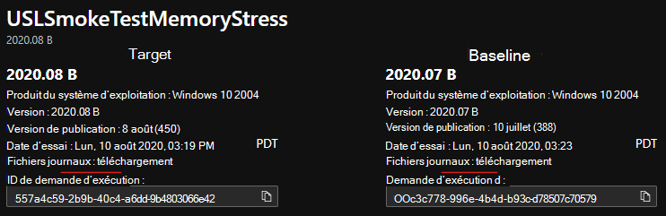

# <a name="memory-regression-analysis"></a><span data-ttu-id="4816a-103">Analyse de la régression de la mémoire</span><span class="sxs-lookup"><span data-stu-id="4816a-103">Memory Regression Analysis</span></span>

<span data-ttu-id="4816a-104">Test Base vous permet de noter plus clairement les augmentations significatives de l’utilisation de la mémoire dans les ordinateurs VM test exécutant vos applications.</span><span class="sxs-lookup"><span data-stu-id="4816a-104">Test Base helps you more clearly notice significant memory usage increases in the test VMs running your apps.</span></span> <span data-ttu-id="4816a-105">Les mesures de performances, telles que l’utilisation de la mémoire, peuvent indiquer l’état global de l’application et nous pensons que cet ajout permettra de maintenir les performances optimales de vos applications.</span><span class="sxs-lookup"><span data-stu-id="4816a-105">Performance metrics, such as memory usage, can be indicative of overall application health and we believe this addition will greatly help keep your apps performing optimally.</span></span>

<span data-ttu-id="4816a-106">Lisez la suite pour plus d’informations ou regardez cette vidéo pour obtenir une présentation rapide des dernières améliorations.</span><span class="sxs-lookup"><span data-stu-id="4816a-106">Read on for more details or watch this video for a quick walk through of the latest improvements.</span></span> 

<span data-ttu-id="4816a-107">Pour plus d’informations sur la capacité de base de test de M365 à faciliter l’analyse de régression, voir Résultats de régression basés sur la fiabilité des processus.</span><span class="sxs-lookup"><span data-stu-id="4816a-107">For more information on Test Base for M365's ability to help with regression analysis, see Regression results based on process reliability.</span></span>

<span data-ttu-id="4816a-108"><b>En regardant de plus près les régressions de mémoire</b></span><span class="sxs-lookup"><span data-stu-id="4816a-108"><b>Looking closer at memory regressions</b></span></span>

<span data-ttu-id="4816a-109">Le tableau de bord Base de test pour M365 affiche la mémoire consommée par votre application sur une nouvelle mise à jour Windows pré-publiée et la compare à la mémoire utilisée par la dernière mise à jour Windows publiée.</span><span class="sxs-lookup"><span data-stu-id="4816a-109">The Test Base for M365 dashboard shows the memory consumed by your application on a new pre-released Windows update and compares it with the memory used by the last released Windows update.</span></span> 

<span data-ttu-id="4816a-110">Grâce aux améliorations apportées ce mois-ci, l’analyse de la régression de la mémoire est désormais mise en avant dans vos processus favoris.</span><span class="sxs-lookup"><span data-stu-id="4816a-110">With this month’s enhancements, memory regression analysis is now featured in your favorited processes.</span></span> <span data-ttu-id="4816a-111">Les applications peuvent contenir plusieurs processus et vous pouvez sélectionner manuellement vos processus favoris via l’onglet Fiabilité. Notre service identifiera ensuite les régressions de mémoire dans ces processus favoris tout en comparant les tests s’exécutent entre Windows mises à jour.</span><span class="sxs-lookup"><span data-stu-id="4816a-111">Applications can contain multiple processes and you can manually select your favorite processes through the Reliability tab. Our service will then identify memory regressions in these favorited processes while comparing test runs across different Windows update releases.</span></span> <span data-ttu-id="4816a-112">Si une régression est détectée, des détails sur la régression sont facilement disponibles.</span><span class="sxs-lookup"><span data-stu-id="4816a-112">If a regression is detected, details about the regression are easily available.</span></span>

<span data-ttu-id="4816a-113">Examinons maintenant cette fonctionnalité en détail et voyons comment résoudre les problèmes de régression de mémoire à l’aide de Windows Performance Analyzer.</span><span class="sxs-lookup"><span data-stu-id="4816a-113">Now let's look at this feature in detail and discuss how you can troubleshoot memory regressions using Windows Performance Analyzer.</span></span>

<span data-ttu-id="4816a-114">Le signal d’échec provoqué par une régression de mémoire est affiché dans la base de test pour le tableau de bord M365 de la page des résultats des tests sous Utilisation de la mémoire :</span><span class="sxs-lookup"><span data-stu-id="4816a-114">The failure signal caused by a memory regression is shown in the Test Base for M365 dashboard on the Test results page under Memory Utilization:</span></span>


<span data-ttu-id="4816a-116">L’échec de l’application en raison d’une consommation de mémoire plus élevée s’affiche également dans la page Résumé ```Fail``` des tests :</span><span class="sxs-lookup"><span data-stu-id="4816a-116">Failure for the application due to higher memory consumption, will also be displayed as ```Fail``` on the Test Summary page:</span></span>


<span data-ttu-id="4816a-118">En fournissant ces signaux d’échec à l’avance, notre objectif est de marquer clairement les problèmes potentiels qui peuvent perturber et avoir un impact sur l’expérience de l’utilisateur final pour votre application.</span><span class="sxs-lookup"><span data-stu-id="4816a-118">By providing these failure signals upfront, our goal is to clearly flag potential issues that can disrupt and impact the end user experience for your application.</span></span> 

<span data-ttu-id="4816a-119">Vous pouvez ensuite télécharger les fichiers journaux et utiliser Windows Performance Analyzer, ou votre boîte à outils préférée, pour étudier plus en détail.</span><span class="sxs-lookup"><span data-stu-id="4816a-119">You can then download the log files and use the Windows Performance Analyzer, or your preferred toolkit, to investigate further.</span></span> <span data-ttu-id="4816a-120">Vous pouvez également travailler en collaboration avec l’équipe de base de test pour M365 pour résoudre le problème et éviter les problèmes qui ont un impact sur les utilisateurs finaux.</span><span class="sxs-lookup"><span data-stu-id="4816a-120">You can also work jointly with the Test Base for M365 team on remediating the issue and help prevent issues impacting end users.</span></span>

<span data-ttu-id="4816a-121">Les signaux de mémoire sont capturés dans l’onglet Utilisation de la mémoire dans la base de test pour le service M365 pour toutes les séries de tests.</span><span class="sxs-lookup"><span data-stu-id="4816a-121">Memory signals are captured in the Memory Utilization tab in the Test Base for M365 service for all test runs.</span></span> <span data-ttu-id="4816a-122">L’exemple ci-dessous illustre une série de tests récents avec l’application intégré « Stress de mémoire de test de la tension » par rapport à la mise à jour de sécurité d’août 2020 pré-publiée.</span><span class="sxs-lookup"><span data-stu-id="4816a-122">The example below shows a recent test run with the onboarded application “Smoke Test Memory Stress” against the pre-release August 2020 security update.</span></span> <span data-ttu-id="4816a-123">(Cette application a été écrite par notre équipe pour illustrer les régressions de mémoire.)</span><span class="sxs-lookup"><span data-stu-id="4816a-123">(This application was written by our team to illustrate memory regressions.)</span></span>


<span data-ttu-id="4816a-125">Dans cet exemple, le processus favori « USLTestMemoryStress.exe » a consommé une moyenne d’environ 100 Mo sur la mise à jour d’août pré-publiée par rapport à la mise à jour publiée en juillet, d’où la base de test pour M365 a identifié une régression.</span><span class="sxs-lookup"><span data-stu-id="4816a-125">In this example, the favorite process “USLTestMemoryStress.exe” process consumed an average of approximately 100 MB on the pre-release August update compared to the released July update, hence the Test Base for M365 identified a regression.</span></span> 

<span data-ttu-id="4816a-126">Les autres processus, présentés ici sous les formes « USLTestMemoryStress_Aux1.exe » et « USLTestMemoryStress_Aux2.exe », appartiennent également à la même application, mais ont consommé à peu près la même quantité de mémoire pour les deux releases afin qu’elles « passent » et sont considérées comme saines.</span><span class="sxs-lookup"><span data-stu-id="4816a-126">The other processes—shown here as “USLTestMemoryStress_Aux1.exe” and “USLTestMemoryStress_Aux2.exe”—also belong to the same application, but consumed approximately the same amount of memory for the two releases so they "passed" and were considered healthy.</span></span>

<span data-ttu-id="4816a-127">La régression sur le processus principal a été déterminée comme « significative du point de vue statistique », de sorte que le service a communiqué et mis en évidence cette différence pour l’utilisateur.</span><span class="sxs-lookup"><span data-stu-id="4816a-127">The regression on the main process was determined to be “statistically significant” so the service communicated and highlighted this difference to the user.</span></span> <span data-ttu-id="4816a-128">Si la comparaison n’était pas significative d’un point de vue statistique, elle ne serait pas mise en évidence.</span><span class="sxs-lookup"><span data-stu-id="4816a-128">If the comparison was not statistically significant, it would not be highlighted.</span></span> <span data-ttu-id="4816a-129">L’utilisation de la mémoire peut être bruyante. Nous utilisons donc des modèles statistiques pour distinguer, entre les builds et les releases, les différences significatives par rapport aux différences non significatives.</span><span class="sxs-lookup"><span data-stu-id="4816a-129">Memory utilization can be noisy, so we use statistical models to distinguish, across builds and releases, meaningful differences from inconsequential differences.</span></span> 

<span data-ttu-id="4816a-130">Une comparaison peut rarement être signalée lorsqu’il n’existe aucune différence réelle (faux positif), mais il s’agit d’un compromis nécessaire pour améliorer la probabilité d’identifier correctement les régressions (ou les vrais positifs).)</span><span class="sxs-lookup"><span data-stu-id="4816a-130">A comparison may rarely be flagged when there is no true difference (a false positive), but this is a necessary tradeoff to improve the likelihood of correctly identifying regressions (or true positives.)</span></span>

<span data-ttu-id="4816a-131">L’étape suivante consiste à comprendre ce qui a provoqué la régression de la mémoire.</span><span class="sxs-lookup"><span data-stu-id="4816a-131">The next step is to understand what caused the memory regression.</span></span> <span data-ttu-id="4816a-132">Vous pouvez télécharger les fichiers zip pour les deux exécutions à partir de l’option Télécharger les fichiers journaux, comme illustré ci-dessous.</span><span class="sxs-lookup"><span data-stu-id="4816a-132">You can download the zip files for both executions from the Download log files option, as shown below.</span></span> 

<span data-ttu-id="4816a-133">Ces fichiers zip contiennent les résultats de votre exécution de test, y compris les résultats des scripts, la mémoire et les données de performances du processeur incluses dans le fichier ETL.</span><span class="sxs-lookup"><span data-stu-id="4816a-133">These zip files contain the results of your test run, including script results and memory and CPU performance data which is included in the ETL file.</span></span>



<span data-ttu-id="4816a-135">Vous pouvez télécharger et déconnecter les journaux pour les deux séries de tests, puis localiser le fichier ETL dans chaque dossier et les renommer en tant que target.etl (pour l’essai exécuté sur la mise à jour pré-publication) et baseline.etl (pour le test exécuté lors de la dernière mise à jour publiée) pour simplifier l’exploration et la navigation.</span><span class="sxs-lookup"><span data-stu-id="4816a-135">You can download and unzip the logs for the two test runs, then locate the ETL file within each folder and rename them as target.etl (for the test run on the pre-release update) and baseline.etl (for the test run on last released update) to simplify exploration and navigation.</span></span>
 
## <a name="next-steps"></a><span data-ttu-id="4816a-136">Étapes suivantes</span><span class="sxs-lookup"><span data-stu-id="4816a-136">Next steps</span></span>

<span data-ttu-id="4816a-137">Passer à l’article suivant pour commencer à comprendre l’analyse intelligente de la régression du processeur.</span><span class="sxs-lookup"><span data-stu-id="4816a-137">Advance to the next article to get started with understanding intelligent CPU regression analysis.</span></span>
> [!div class="nextstepaction"]
> [<span data-ttu-id="4816a-138">Étape suivante</span><span class="sxs-lookup"><span data-stu-id="4816a-138">Next step</span></span>](cpu.md)

<!---
Add button for next page
-->
