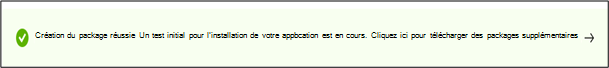

# <a name="step-6-review-your-selections-to-create-your-package"></a><span data-ttu-id="8c162-103">Étape 6 : examinez vos sélections pour créer votre package.</span><span class="sxs-lookup"><span data-stu-id="8c162-103">Step 6: Review your selections to create your package.</span></span>

1.  <span data-ttu-id="8c162-104">Sous cet onglet, le service affiche les détails de vos tests et exécute une vérification rapide de l’intégralité.</span><span class="sxs-lookup"><span data-stu-id="8c162-104">On this tab, the service displays your test details and runs a quick completeness check.</span></span> 

    <span data-ttu-id="8c162-105">Un ```Validation passed``` ou plusieurs messages ```Validation failed``` indiquent si vous pouvez passer aux étapes suivantes ou non.</span><span class="sxs-lookup"><span data-stu-id="8c162-105">A ```Validation passed``` or ```Validation failed``` message shows whether you can proceed to next steps or not.</span></span>

2.  <span data-ttu-id="8c162-106">Examinez les détails de votre test et, si vous êtes satisfait, cliquez sur le ```Create``` bouton.</span><span class="sxs-lookup"><span data-stu-id="8c162-106">Review your test details and if satisfied, click on the ```Create``` button.</span></span> 


3.  <span data-ttu-id="8c162-108">Cela intégrera votre package à l’environnement de base de test.</span><span class="sxs-lookup"><span data-stu-id="8c162-108">This will onboard your package to the Test Base environment.</span></span> <span data-ttu-id="8c162-109">Si votre package est correctement créé, un test automatisé qui vérifie si votre package peut être correctement exécuté sur Azure sera déclenché.</span><span class="sxs-lookup"><span data-stu-id="8c162-109">If your package is successfully created, an automated test which verifys whether your package can be successfully executed on Azure will be triggered.</span></span>



> [!Note]
> <span data-ttu-id="8c162-111">Vous recevez une notification du portail Azure pour vous informer de la réussite ou de l’échec de la vérification du package.</span><span class="sxs-lookup"><span data-stu-id="8c162-111">You will get a notification from the Azure portal to notify you on the success or failure of the package verification.</span></span> 
>
> <span data-ttu-id="8c162-112">Notez que le processus peut prendre jusqu’à 24 heures. Il est donc probable que votre page web arrive à terme si vous n’y êtes pas actif et, par conséquent, la notification ne vous informe pas de la fin de cette exécution à la demande.</span><span class="sxs-lookup"><span data-stu-id="8c162-112">Please note that the process can take up to 24 hours, so it is likely your webpage will timeout if you are not active on it and hence, the notification will not inform you of the completion of this on-demand run.</span></span> 

  - <span data-ttu-id="8c162-113">Cela se produit, vous pouvez afficher l’état de votre package sous ```Manage packages``` l’onglet.</span><span class="sxs-lookup"><span data-stu-id="8c162-113">Peradventure this happens, you can view the status of your package on the ```Manage packages``` tab.</span></span>


  - <span data-ttu-id="8c162-115">Pour des tests réussis, leurs résultats peuvent être vus via les pages et à intervalles réguliers, souvent quelques jours après ```Test Summary``` ```Security Updates Results``` votre ```Feature Updates Results``` téléchargement.</span><span class="sxs-lookup"><span data-stu-id="8c162-115">For succesful tests, their results can be seen via the ```Test Summary```, ```Security Updates Results``` and ```Feature Updates Results``` pages at scheduled intervals, often starting a few days after your upload.</span></span>
  
  - <span data-ttu-id="8c162-116">En cas d’échec des tests, vous devez télécharger un nouveau package.</span><span class="sxs-lookup"><span data-stu-id="8c162-116">While failed tests, require you to upload a new package.</span></span> 
  
    <span data-ttu-id="8c162-117">Vous pouvez télécharger les pages et les pages pour une ```test logs``` analyse ```Security update results``` plus ```Feature updates results``` approfondie.</span><span class="sxs-lookup"><span data-stu-id="8c162-117">You can download the ```test logs``` for further analysis from the ‘```Security update results``` and ```Feature updates results``` pages.</span></span>

  - <span data-ttu-id="8c162-118">Si vous faites face à des échecs de test répétés, contactez testbasepreview@microsoft.com avec les détails de votre erreur.</span><span class="sxs-lookup"><span data-stu-id="8c162-118">If you experience repeated test failures, please reach out to testbasepreview@microsoft.com with details of your error.</span></span> 

## <a name="next-steps"></a><span data-ttu-id="8c162-119">Étapes suivantes</span><span class="sxs-lookup"><span data-stu-id="8c162-119">Next steps</span></span>

<span data-ttu-id="8c162-120">Découvrez nos recommandations en matière de contenu via le lien ci-dessous.</span><span class="sxs-lookup"><span data-stu-id="8c162-120">Discover our Content Guidelines via the link below.</span></span>
> [!div class="nextstepaction"]
> [<span data-ttu-id="8c162-121">Étape suivante</span><span class="sxs-lookup"><span data-stu-id="8c162-121">Next step</span></span>](contentguideline.md)
