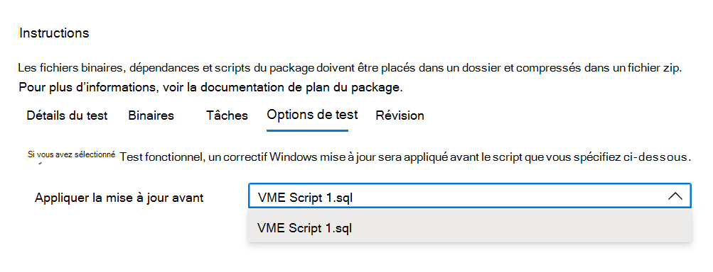

# <a name="step-5-choose-your-test-options"></a><span data-ttu-id="04c11-103">Étape 5 : Choisissez vos options de test.</span><span class="sxs-lookup"><span data-stu-id="04c11-103">Step 5: Choose your test options.</span></span> 

<span data-ttu-id="04c11-104">L’onglet est pour les utilisateurs qui souhaitent effectuer des tests fonctionnels afin d’indiquer quand le correctif Windows Update doit être appliqué dans la séquence d’exécution de ```Test Options``` leurs scripts de test fonctionnels.</span><span class="sxs-lookup"><span data-stu-id="04c11-104">The ```Test Options``` tab is for users who wish to perform functional tests to indicate when the Windows Update patch should be applied in the sequence of executing their functional test scripts.</span></span>



<span data-ttu-id="04c11-107">Sélectionnez _**Révision**_ pour accéder à l’onglet suivant et passer en revue les options de test sélectionnées.</span><span class="sxs-lookup"><span data-stu-id="04c11-107">Select _**Review**_ to navigate to the next tab and review your selected test options.</span></span>

## <a name="next-steps"></a><span data-ttu-id="04c11-108">Étapes suivantes</span><span class="sxs-lookup"><span data-stu-id="04c11-108">Next steps</span></span>

<span data-ttu-id="04c11-109">Vous trouverez plus d’informations sur l’étape d’imbrouillement dans l’article suivant via le lien ci-dessous :</span><span class="sxs-lookup"><span data-stu-id="04c11-109">Details of the nest step can be seen in the next article via the link below:</span></span>
> [!div class="nextstepaction"]
> [<span data-ttu-id="04c11-110">Étape suivante</span><span class="sxs-lookup"><span data-stu-id="04c11-110">Next step</span></span>](review.md)
