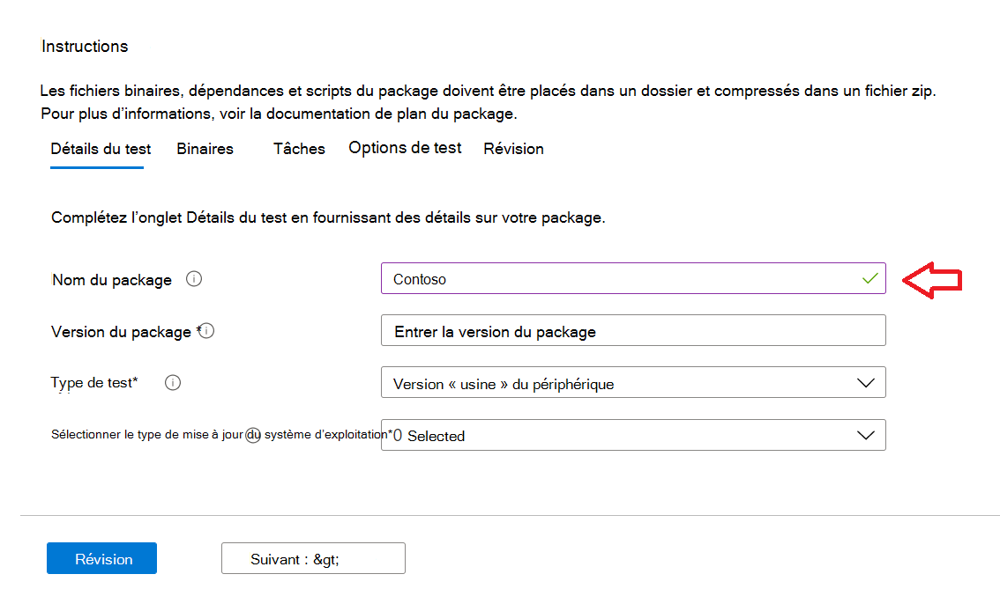
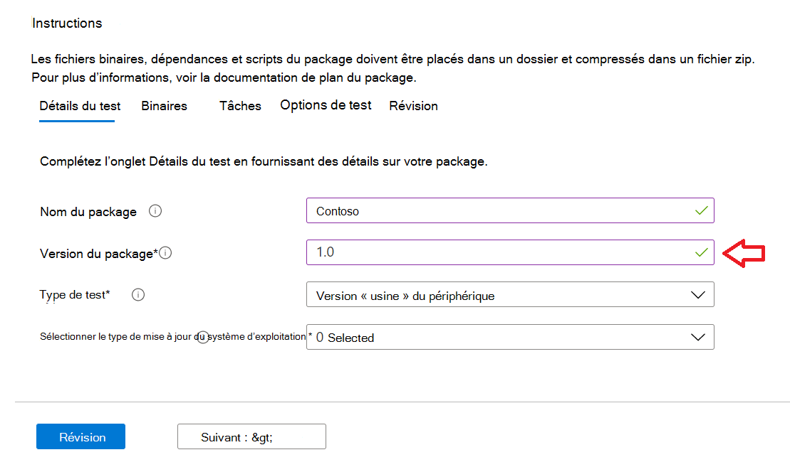

# <a name="step-2-uploading-a-package"></a><span data-ttu-id="d1975-103">Étape 2 : Téléchargement d’un package</span><span class="sxs-lookup"><span data-stu-id="d1975-103">Step 2: Uploading a Package</span></span>

<span data-ttu-id="d1975-104">Dans la page Portail de base de test, accédez à l’option « Télécharger nouveau package » dans la barre de navigation de gauche, comme indiqué ci-dessous : Télécharger </span><span class="sxs-lookup"><span data-stu-id="d1975-104">On the Test Base portal page, navigate to the ‘Upload new package option on the left navigation bar as shown below: </span></span>

<span data-ttu-id="d1975-105">Une fois là, suivez les étapes ci-dessous pour télécharger un nouveau package.</span><span class="sxs-lookup"><span data-stu-id="d1975-105">Once there, follow the steps below to upload a new package.</span></span>

## <a name="enter-details-for-your-package"></a><span data-ttu-id="d1975-106">Entrer les détails de votre package</span><span class="sxs-lookup"><span data-stu-id="d1975-106">Enter details for your package</span></span>

<span data-ttu-id="d1975-107">Sous l’onglet Détails du test, tapez le nom, la version et d’autres détails de votre package, comme demandé.</span><span class="sxs-lookup"><span data-stu-id="d1975-107">On the Test details tab, type in your package's name, version and other details as requested.</span></span> 

<span data-ttu-id="d1975-108">Vous pouvez faire  des tests fonctionnels et **out-of-box** via ce tableau de bord.</span><span class="sxs-lookup"><span data-stu-id="d1975-108">**Out-of-Box** and **Functional testing** can be done via this dashboard.</span></span>

<span data-ttu-id="d1975-109">Les étapes ci-dessous fournissent un guide sur la façon de remplir les détails de votre package :</span><span class="sxs-lookup"><span data-stu-id="d1975-109">The steps below provides a guide on how to fill out your package details:</span></span>

1.  <span data-ttu-id="d1975-110">**Entrez le nom à donner à votre package dans le ```“Package name``` champ.**</span><span class="sxs-lookup"><span data-stu-id="d1975-110">**Enter the name to be given your package in the ```“Package name``` field.**</span></span>

> [!Note]  
> <span data-ttu-id="d1975-111">Le nom du package et la combinaison de version entrés doivent être uniques au sein de votre organisation.</span><span class="sxs-lookup"><span data-stu-id="d1975-111">The package name and version combination entered must be unique within your organization.</span></span> <span data-ttu-id="d1975-112">Cette vérification est validée par la coche, comme illustré ci-dessous.</span><span class="sxs-lookup"><span data-stu-id="d1975-112">This is validated by the checkmark as shown below.</span></span>
  
  - <span data-ttu-id="d1975-113">Si vous choisissez de ré-utiliser le nom d’un package, le numéro de version doit être unique (c’est-à-dire qu’il n’a jamais été utilisé avec un package portant ce nom particulier).</span><span class="sxs-lookup"><span data-stu-id="d1975-113">If you choose to re-use an package's name, then the version number must be unique (i.e. never been used with an package bearing that particular name).</span></span>
  - <span data-ttu-id="d1975-114">Si la combinaison du nom du package + de la version ne passe pas la vérification de l’unicité, vous verrez un message d’erreur qui indique : « Le package avec cette version de *package* existe déjà ».</span><span class="sxs-lookup"><span data-stu-id="d1975-114">If the combination of the package name + version does not pass the uniqueness check, you will see an error message which reads, *“Package with this package version already exists”*.</span></span> 



2. <span data-ttu-id="d1975-116">**Entrez une version dans le champ « Version du package ».**</span><span class="sxs-lookup"><span data-stu-id="d1975-116">**Enter a version in the “Package version” field.**</span></span>



3.  <span data-ttu-id="d1975-118">**Sélectionnez le type de test que vous souhaitez exécuter sur ce package**</span><span class="sxs-lookup"><span data-stu-id="d1975-118">**Select the type of test you want to run on this package**</span></span>

    <span data-ttu-id="d1975-119">Un **test OOB (Out-of-Box)** effectue une *installation,* un *lancement,* *une* fermeture et *une désinstallation* de votre package.</span><span class="sxs-lookup"><span data-stu-id="d1975-119">An **Out-of-Box (OOB)** test performs an *install*, *launch*, *close* and *uninstall* of your package.</span></span> <span data-ttu-id="d1975-120">Après l’installation, la routine de fermeture de lancement est répétée 30 fois avant l’opération de désinstallation unique.</span><span class="sxs-lookup"><span data-stu-id="d1975-120">After the install, the launch-close routine is repeated 30 times before a single uninstall is run.</span></span> 
    
    <span data-ttu-id="d1975-121">Ce test OOB vous fournit une télémétrie normalisée sur votre package à comparer entre Windows builds.</span><span class="sxs-lookup"><span data-stu-id="d1975-121">This OOB test provides you with standardized telemetry on your package to compare across Windows builds.</span></span>

    <span data-ttu-id="d1975-122">Un **test fonctionnel** exécuterait vos scripts de test téléchargés sur votre package.</span><span class="sxs-lookup"><span data-stu-id="d1975-122">A **Functional test** would execute your uploaded test script(s) on your package.</span></span> <span data-ttu-id="d1975-123">Les scripts sont exécutés dans la séquence de chargement et un échec dans un script particulier arrête l’exécution des scripts suivants.</span><span class="sxs-lookup"><span data-stu-id="d1975-123">The scripts are run in upload sequence and a failure in a particular script will stop subsequent scripts from executing.</span></span>

> [!Note]
> <span data-ttu-id="d1975-124">**Tous** les scripts s’exécutent pendant 80 minutes au maximum.</span><span class="sxs-lookup"><span data-stu-id="d1975-124">**All** scripts run for 80 minutes at the most.</span></span> 
    
4.  <span data-ttu-id="d1975-125">**Sélectionner le type de mise à jour du système d’exploitation**</span><span class="sxs-lookup"><span data-stu-id="d1975-125">**Select the OS update type**</span></span>

   - <span data-ttu-id="d1975-126">Les « mises à jour de sécurité » permettent de tester votre package contre les évolutions incrémentielles de Windows mises à jour de sécurité mensuelles pré-publiées.</span><span class="sxs-lookup"><span data-stu-id="d1975-126">The ‘Security updates’ enables your package to be tested against incremental churns of Windows pre-release monthly security updates.</span></span> 
   - <span data-ttu-id="d1975-127">Les « mises à jour des fonctionnalités » permettent de tester votre package par rapport aux mises à jour de fonctionnalités Windows pré-publication bi-annuelles à partir du programme Windows Insider.</span><span class="sxs-lookup"><span data-stu-id="d1975-127">The ‘Feature updates’ enables your package to be tested against Windows pre-release bi-annual feature updates builds from the Windows Insider Program.</span></span>
<!---
Change to the correct picture
-->


5.  <span data-ttu-id="d1975-129">**Sélectionnez les versions du système d’exploitation pour les tests de mise à jour de sécurité.**</span><span class="sxs-lookup"><span data-stu-id="d1975-129">**Select the OS version(s) for Security update tests.**</span></span>

<span data-ttu-id="d1975-130">Dans la sélection multiple, sélectionnez la ou les versions du système d’exploitation Windows votre package sera installé.</span><span class="sxs-lookup"><span data-stu-id="d1975-130">In the multi-select dropdown, select the OS version(s) of Windows your package will be installed on.</span></span> 

  - <span data-ttu-id="d1975-131">Pour tester votre package par rapport Windows OSes client uniquement, sélectionnez les versions Windows système d’exploitation 11 dans la liste de menus.</span><span class="sxs-lookup"><span data-stu-id="d1975-131">To test your package against Windows Client OSes only, select the applicable Windows 11 OS versions from the menu list.</span></span>
  - <span data-ttu-id="d1975-132">Pour tester votre package par rapport Windows OSes serveur uniquement, sélectionnez les versions Windows système d’exploitation serveur applicables dans la liste de menus.</span><span class="sxs-lookup"><span data-stu-id="d1975-132">To test your package against Windows Server OSes only, select the applicable Windows Server OS versions from the menu list.</span></span>
  - <span data-ttu-id="d1975-133">Pour tester votre package par rapport Windows OSe client et serveur, sélectionnez toutes les OS applicables dans la liste de menus.</span><span class="sxs-lookup"><span data-stu-id="d1975-133">To test your package against Windows Client and Server OSes, select all applicable OSes from the menu list.</span></span> 

> [!Note]
> <span data-ttu-id="d1975-134">Si vous choisissez de tester votre package par rapport aux OS serveur et client, assurez-vous que le package est compatible et qu’il peut s’exécuter sur les deux OSes</span><span class="sxs-lookup"><span data-stu-id="d1975-134">If you select to test your package against both Server and Client OSes, please make sure that the package is compatible and can run on both OSes</span></span>


<!---
Change to the correct picture
-->
6.  <span data-ttu-id="d1975-136">**Sélectionnez les options pour les tests de mise à jour des fonctionnalités :**</span><span class="sxs-lookup"><span data-stu-id="d1975-136">**Select options for Feature update tests:**</span></span>

  - <span data-ttu-id="d1975-137">Dans l’option « Sélectionner le canal Insider », sélectionnez la build sur laquelle vos packages doivent ```Windows Insider Program Channel``` être testés.</span><span class="sxs-lookup"><span data-stu-id="d1975-137">On the option to “Select Insider Channel”, select the ```Windows Insider Program Channel``` as the build which your packages should be tested against.</span></span>
  
    <span data-ttu-id="d1975-138">Nous utilisons actuellement les builds dont la version d’essai est disponible dans le canal Insider Beta.</span><span class="sxs-lookup"><span data-stu-id="d1975-138">We currently use builds flighted in the Insider Beta Channel.</span></span>

  - <span data-ttu-id="d1975-139">Dans l’option « Sélectionner la ligne de base du système d’exploitation pour Insight », sélectionnez la version Windows système d’exploitation à utiliser comme base pour comparer les résultats de vos tests.</span><span class="sxs-lookup"><span data-stu-id="d1975-139">On the option to “Select OS baseline for Insight”, select the Windows OS version to be used as a baseline in comparing your test results.</span></span> 

> [!Note]
> <span data-ttu-id="d1975-140">Pour le moment, nous ne supportons PAS les tests de mise à jour des fonctionnalités pour les OS de serveur.</span><span class="sxs-lookup"><span data-stu-id="d1975-140">We DO NOT support Feature update testing for Server OSes at this time</span></span>
<!---
Note to actual note format for markdown
-->
<!---
Change to the correct picture
-->


7.  <span data-ttu-id="d1975-142">Une page de détails test terminée doit ressembler à ceci :</span><span class="sxs-lookup"><span data-stu-id="d1975-142">A completed Test details page should look like this:</span></span> 


## <a name="next-steps"></a><span data-ttu-id="d1975-144">Étapes suivantes</span><span class="sxs-lookup"><span data-stu-id="d1975-144">Next steps</span></span>

<span data-ttu-id="d1975-145">Notre article suivant traite du chargement de vos fichiers binaires vers notre serivce.</span><span class="sxs-lookup"><span data-stu-id="d1975-145">Our next article covers Uploading your Binaries to our serivce.</span></span>
> [!div class="nextstepaction"]
> [<span data-ttu-id="d1975-146">Étape suivante</span><span class="sxs-lookup"><span data-stu-id="d1975-146">Next step</span></span>](binaries.md)

<!---
Add button for next page
-->

